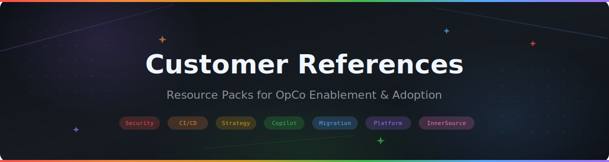

  

  

<h1 align="center">Customer References — Resource Packs</h1>

  <em>Everything your OpCo needs to evaluate, adopt, and scale GitHub across the enterprise.</em>

---

## 📚 Resource Packs

| Pack | Description | Link |
|------|-------------|------|
| 🤖 **AI - Center of Excellence** | Establish an AICOE — charter, governance, Copilot adoption playbook, and leadership deck | [→ Open](./AI%20-%20Center%20of%20Excellence/README.md) |
| 🚀 **Getting Started with GitHub** | Plans, licensing, instance types, admin setup, and launching a trial | [→ Open](./Getting%20Started%20with%20GitHub/README.md) |
| 🔧 **GitHub Actions & CI/CD** | Workflows, runners, starter templates, migration from other CI tools | [→ Open](./GitHub%20Actions%20and%20CICD/README.md) |
| ✨ **GitHub Copilot Adoption** | Business case, rollout strategy, prompt engineering, measuring ROI | [→ Open](./GitHub%20Copilot%20Adoption/README.md) |
| 🛡️ **Security & Compliance** | GHAS rollout, supply chain security, compliance frameworks, incident response | [→ Open](./Security%20and%20Compliance/README.md) |
| 🤝 **InnerSource Playbook** | Cross-team collaboration, contribution guidelines, governance, metrics | [→ Open](./InnerSource%20Playbook/README.md) |
| ✈️ **Migration & Onboarding** | Migrate from Azure DevOps, GitLab, Bitbucket, SVN + developer onboarding | [→ Open](./Migration%20and%20Onboarding/README.md) |
| 🏗️ **Platform Engineering** | Template repos, rulesets, GitHub Apps, internal developer portals | [→ Open](./Platform%20Engineering/README.md) |
| 📊 **Executive & Leadership** | TCO analysis, ROI frameworks, competitive positioning, exec presentation templates | [→ Open](./Executive%20and%20Leadership/README.md) |

---

## 🗺️ Suggested Reading Order

| Stage | Packs |
|-------|-------|
| **Exploring GitHub** | Getting Started → Executive & Leadership |
| **Ready to trial** | Getting Started (doc 06) → Admin Setup (doc 03) |
| **Rolling out Copilot** | Copilot Adoption → AI - Center of Excellence |
| **Migrating platforms** | Migration & Onboarding → GitHub Actions & CI/CD |
| **Scaling & governance** | Security & Compliance → Platform Engineering → InnerSource |

---

## 📰 Other Resources

| Folder | Description |
|--------|-------------|
| [Monthly Newsletters](./Monthly%20Newsletters/) | Recurring updates and highlights |
| [Reference](./Reference/) | Additional reference materials |

---

## Contributing

These packs are living documents. Update them as GitHub evolves, add OpCo-specific customizations, and share feedback with the team.

---

  Maintained by the GitHub Customer Success team

